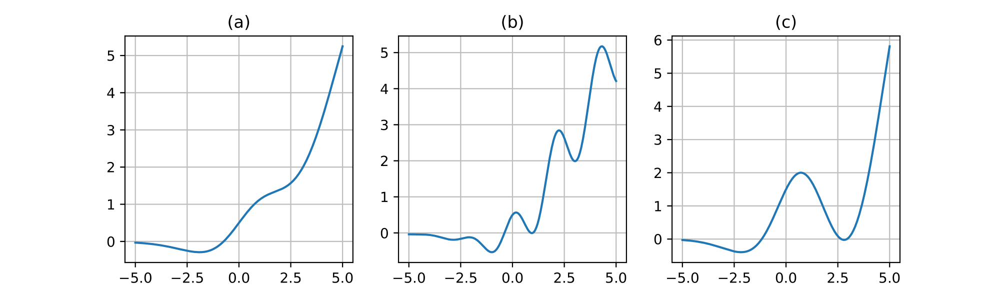
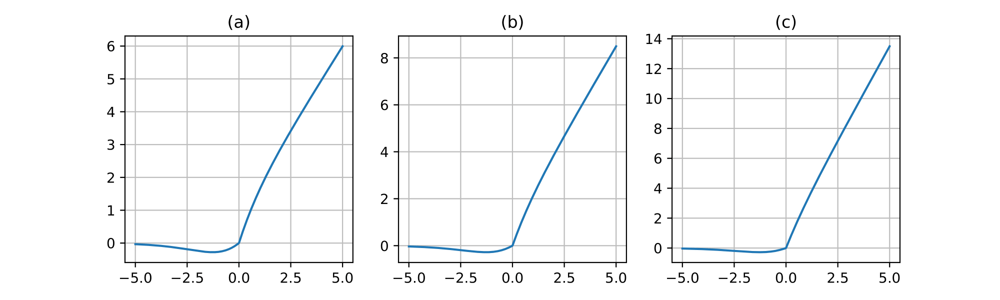
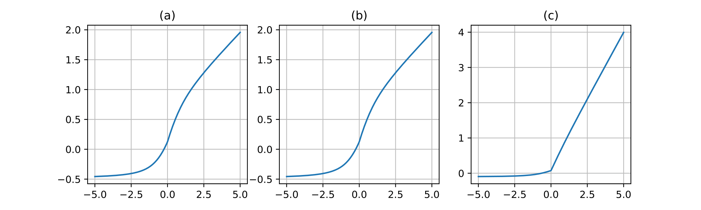
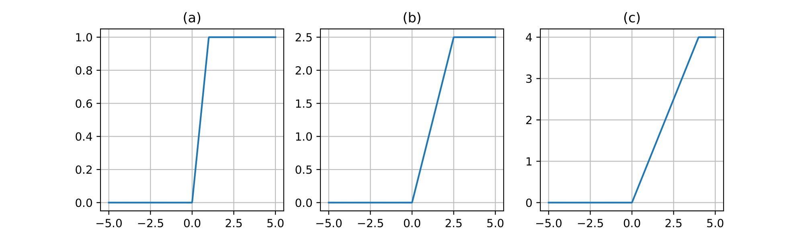
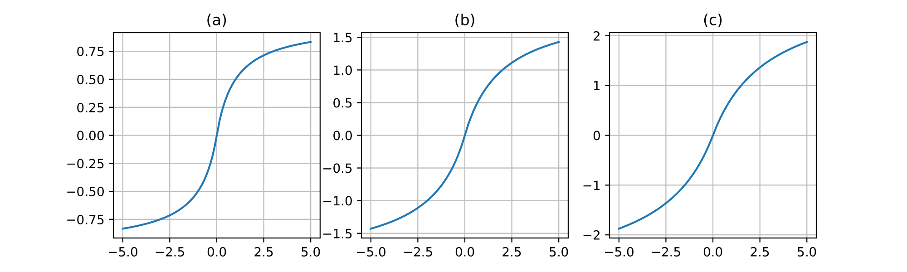
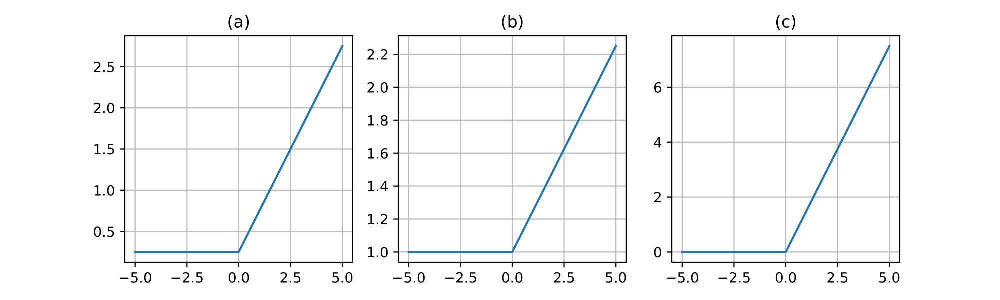

<h1 align="center">Trainable Activations for Image Classification</h1>

We propose a set of the trainable activation functions — Cosinu-Sigmoidal Linear Unit (CosLU),  DELU, Linear Combination (LinComb), Normalized Linear Combination (NormLinComb), Rectified Linear Unit N (ReLUN), Scaled Soft Sign (ScaledSoftSign), Shifted Rectified Linear Unit (ShiLU).

[Pretrained weights.](https://www.kaggle.com/datasets/pe4eniks/trainable-activations-checkpoints)

<h2 align="center">CosLU</h2>

$$CosLU(x) = (x + \alpha \cos(\beta x))\sigma(x)$$

$$\sigma(x) = \frac{1}{1 + e^{-x}}$$

<h2 align="center">DELU</h2>

$$
DELU(x) = \begin{cases} 
SiLU(x), x \leqslant 0 \\ 
(n + 0.5)x + |e^{-x} - 1|, x > 0 
\end{cases}
$$

$$SiLU(x) = x\sigma(x)$$

<h2 align="center">LinComb</h2>

$$LinComb(x) = \sum\limits_{i=0}^{n} w_i \mathcal{F}_i(x)$$

<h2 align="center">NormLinComb</h2>

$$NormLinComb(x) = \frac{\sum\limits_{i=0}^{n} w_i \mathcal{F}_i(x)}{\mid \mid W \mid \mid}$$

<h2 align="center">ReLUN</h2>

$$ReLUN(x) = min(max(0, x), n)$$

<h2 align="center">ScaledSoftSign</h2>

$$ScaledSoftSign(x) = \frac{\alpha x}{\beta + |x|}$$

<h2 align="center">ShiLU</h2>

$$ShiLU(x) = \alpha ReLU(x) + \beta$$

$$ReLU(x) = max(0, x)$$

<h2 align="center">CITATION</h2>

Project <a href="CITATION.cff" title="CITATION">CITATION</a>.

<h2 align="center">LICENSE</h2>

Project is distributed under <a href="LICENSE" title="LICENSE">MIT License</a>.

